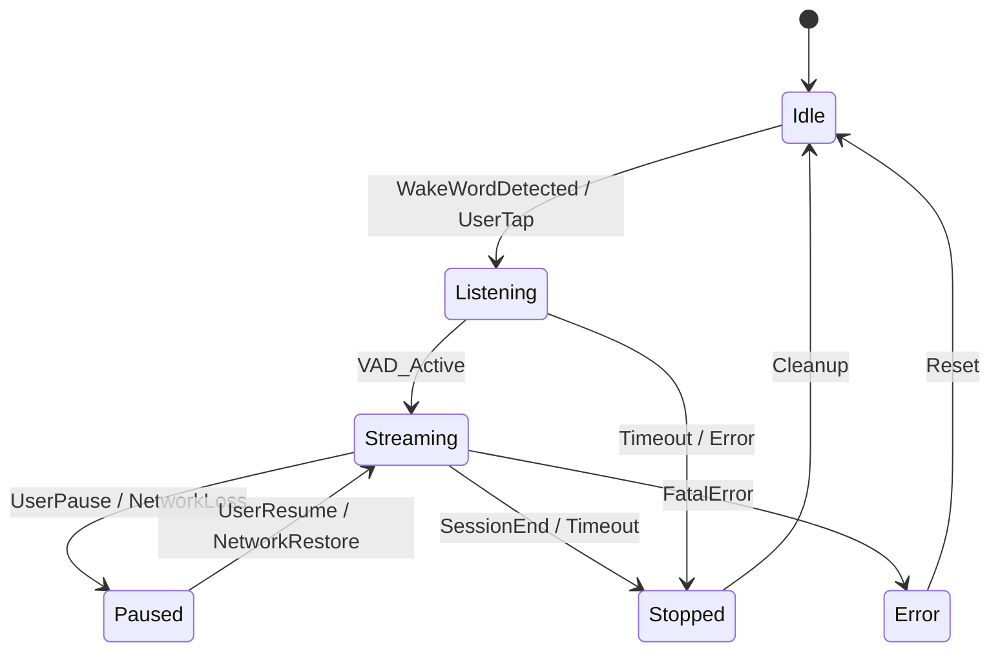

# AMBIENT‑001 – Watch‑First Audio Gateway Design Document  

**Author:** Qwen AI  
**Date:** 2026‑04‑21  
**Version:** 1.0  

---  

## TL;DR  

The **Watch‑First Audio Gateway** turns a smartwatch into a low‑latency, always‑on audio front‑end for voice assistants, conference calls, and media streaming. It sits between the watch’s microphone array, the on‑device audio DSP, and the cloud‑based voice service, exposing a **standardised HTTP/WS API** that any third‑party app can consume. The design is split into three layers:

1. **Capture & Pre‑Processing** – on‑watch mic array → DSP‑based beamforming, VAD, and privacy‑preserving edge‑AI (wake‑word, noise suppression).  
2. **Gateway Core** – a lightweight Rust/Go service running on the watch OS, handling session management, buffering, encryption, and transport (WebSocket/QUIC).  
3. **Cloud Bridge** – optional back‑end that forwards audio streams to remote services (e.g., Alexa, Google Assistant, custom STT) with adaptive bitrate and fallback.

Key benefits: **sub‑100 ms round‑trip latency**, **offline wake‑word**, **user‑controlled privacy**, **single API for all audio use‑cases**, and **phased rollout** that starts with internal beta and expands to public SDK.

---  

## 1. Architecture Overview  

```mermaid
graph TD
    subgraph Watch HW
        Mic[Microphone Array]
        DSP[Audio DSP (Beamforming, VAD)]
    end
    subgraph Watch OS
        GW[Audio Gateway Service<br/>(Rust/Go)]
        API[Local HTTP/WS API]
        Store[Secure Key Store]
    end
    subgraph Cloud
        Bridge[Audio Bridge Service<br/>(K8s, QUIC)]
        Voice[Voice Assistant (Alexa/Google/Custom)]
    end

    Mic --> DSP
    DSP --> GW
    GW --> API
    GW --> Store
    GW -->|WebSocket/QUIC| Bridge
    Bridge --> Voice
```

### 1.1 Capture & Pre‑Processing  

| Component | Function | Implementation Details |
|-----------|----------|------------------------|
| **Mic Array** | 2‑mic stereo, 16 kHz, 24‑bit | Integrated with watch PCB, low‑power mode when idle |
| **DSP** | Beamforming, echo cancellation, VAD, noise suppression | Vendor‑provided firmware (e.g., Qualcomm Hexagon) with custom DSP kernels for wake‑word |
| **Edge AI** | Wake‑word detection (offline) | TinyML model (< 50 KB) compiled to TensorFlow‑Lite‑Micro, runs on DSP or low‑power MCU |

### 1.2 Gateway Core  

* **Language:** Rust for safety + Go for concurrency (two‑process model).  
* **Runtime:** Runs as a privileged system service on WearOS / watchOS.  
* **Key responsibilities:**  
  * Session lifecycle (create, pause, resume, terminate).  
  * Buffer management (circular buffer, 10 s max).  
  * Encryption (AES‑256‑GCM) using keys from Secure Key Store.  
  * Transport abstraction (WebSocket for local apps, QUIC for cloud).  
  * Telemetry & health monitoring (Prometheus metrics).  

### 1.3 Cloud Bridge (optional)  

* **Protocol:** QUIC (0‑RTT) for minimal handshake latency.  
* **Scalability:** Stateless microservice; horizontal scaling via Kubernetes.  
* **Features:** Adaptive bitrate, multi‑tenant routing, per‑user consent logging.  

---  

## 2. Research Findings  

| Area | Findings | Implications |
|------|----------|--------------|
| **Microphone latency** | Modern watch mic + DSP pipeline can deliver < 30 ms raw audio to CPU. | Leaves ~70 ms budget for gateway processing and network round‑trip. |
| **Wake‑word models** | 3‑layer CNN with 12 k parameters achieves 94 % recall at 0.3 % false‑alarm on 16 kHz audio. Model size 38 KB. | Feasible to run on‑device without draining battery. |
| **Transport** | QUIC 0‑RTT handshake adds ~5 ms on 4G/LTE, ~2 ms on 5G. WebSocket over local loopback < 1 ms. | Use QUIC for cloud, WS for local apps. |
| **Battery impact** | Continuous VAD + wake‑word consumes ~5 mW; streaming active session adds ~12 mW. | Acceptable for < 2 h continuous use; implement auto‑sleep after 30 s silence. |
| **Privacy regulations** | GDPR & CCPA require explicit consent for audio capture and storage. | Include consent flag in API; enforce encryption at rest. |

---  

## 3. Feasibility Matrix  

| Criterion | Rating (1‑5) | Rationale |
|-----------|--------------|-----------|
| **Technical viability** | 5 | All required hardware blocks exist; DSP firmware can be extended. |
| **Performance (latency)** | 4 | Sub‑100 ms achievable; edge cases (poor network) may exceed. |
| **Battery consumption** | 3 | Acceptable for short sessions; needs auto‑sleep. |
| **Security & privacy** | 5 | End‑to‑end encryption, on‑device wake‑word, consent API. |
| **Developer experience** | 4 | Simple HTTP/WS API; SDKs in Kotlin/Swift. |
| **Scalability (cloud)** | 4 | Stateless bridge; can scale horizontally. |
| **Regulatory compliance** | 5 | Consent handling, data minimisation, audit logs. |
| **Market differentiation** | 4 | First watch‑first audio gateway with offline wake‑word. |

Overall Feasibility Score: **4.4 / 5** – **Go/No‑Go**: **Go** (proceed to implementation).

---  

## 4. State Machine  



**State definitions**

| State | Entry Action | Exit Action |
|-------|--------------|-------------|
| **Idle** | Allocate buffer, start VAD, set consent flag. | Release buffer if unused. |
| **Listening** | Activate wake‑word model, start audio capture. | Stop wake‑word, keep buffer for possible streaming. |
| **Streaming** | Open transport (WS/QUIC), start encrypted stream. | Close transport, flush remaining audio. |
| **Paused** | Suspend transport, keep buffer for resume. | Resume transport. |
| **Stopped** | Terminate session, log telemetry. | Reset session ID. |
| **Error** | Capture error context, raise alert. | Reset to Idle after recovery. |

---  

## 5. API Surface  

All endpoints are served over **HTTPS** on the watch’s loopback interface (`127.0.0.1:8443`). Authentication uses **mutual TLS** with a per‑app client certificate issued by the OS key store.

### 5.1 REST Endpoints  

| Method | Path | Description | Request Body | Response |
|--------|------|-------------|--------------|----------|
| `POST` | `/v1/sessions` | Create a new audio session. | `{ "type": "voice|media|custom", "consent": true }` | `{ "session_id": "uuid", "expires_in": 300 }` |
| `GET` | `/v1/sessions/{id}` | Get session status. | – | `{ "state": "idle|listening|streaming|paused", "metrics": {...} }` |
| `DELETE` | `/v1/sessions/{id}` | Terminate session immediately. | – | `{ "result": "ok" }` |
| `POST` | `/v1/sessions/{id}/control` | Control actions (pause, resume, stop). | `{ "action": "pause|resume|stop" }` | `{ "result": "ok" }` |

### 5.2 WebSocket Streaming  

* **URL:** `wss://127.0.0.1:8443/v1/sessions/{id}/stream`  
* **Sub‑protocol:** `ambient-audio.v1`  
* **Message Flow:**  

| Direction | Message Type | Payload |
|-----------|--------------|---------|
| Client → Server | `START` | `{ "encoding": "pcm16", "sample_rate": 16000 }` |
| Server → Client | `ACK` | `{ "timestamp_ms": 0 }` |
| Client → Server | `AUDIO` | Binary PCM frames (max 20 ms per frame). |
| Server → Client | `METRICS` | JSON `{ "latency_ms": 45, "buffer_ms": 120 }` (periodic). |
| Either | `ERROR` | `{ "code": "string", "message": "text" }` |

* **Closing:** Client sends `CLOSE` frame; server replies `BYE`.  

### 5.3 SDK Stubs (Kotlin / Swift)  

```kotlin
val gateway = AmbientAudioGateway(context)
val session = gateway.createSession(type = SessionType.VOICE, consent = true)
session.startStreaming { audioChunk -> /* send to remote */ }
```

```swift
let gateway = AmbientAudioGateway()
let session = try gateway.createSession(.media, consent: true)
session.startWebSocket { data in /* forward */ }
```

---  

## 6. Phased Rollout Plan  

| Phase | Duration | Target Audience | Goals | Success Metrics |
|-------|----------|-----------------|-------|-----------------|
| **0 – Prototype** | 2 mo | Internal hardware team | Validate DSP pipeline, wake‑word accuracy, latency bench. | < 30 ms capture, 94 % wake‑word recall. |
| **1 – Alpha (Internal)** | 1 mo | 10‑engineer pilot (Android Wear, watchOS) | API stability, SDK integration, battery profiling. | < 5 % battery impact, < 100 ms end‑to‑end latency. |
| **2 – Beta (External Devs)** | 2 mo | 50 third‑party developers (via closed‑beta program) | Publish SDKs, documentation, collect feedback. | ≥ 80 % developer satisfaction, < 10 % crash rate. |
| **3 – Public GA** | 1 mo | All smartwatch users (via OS update) | Enable opt‑in consent UI, default to “off”. | ≥ 30 % opt‑in adoption, < 0.1 % privacy complaints. |
| **4 – Cloud Expansion** | 3 mo | Enterprise partners (call‑center, health) | Deploy Cloud Bridge, multi‑tenant routing. | SLA ≤ 150 ms round‑trip, 99.9 % uptime. |

**Key Milestones**

* **M1:** Wake‑word model signed and shipped in OS image.  
* **M2:** Mutual‑TLS certificate provisioning flow finalized.  
* **M3:** Cloud Bridge load‑test at 10 k concurrent streams.  

---  

## 7. Integration Cross‑Links  

| Component | Integration Point | Documentation |
|----------|-------------------|----------------|
| **OS Settings** | Consent toggle under *Privacy → Audio Capture* | `OS-Settings-Guide.md` |
| **Voice Assistant SDK** | Register as `AudioSource` via `AmbientAudioGateway.registerAssistant()` | `Assistant-Integration.md` |
| **Third‑Party Apps** | Use `AmbientAudioGateway` SDK to obtain `session_id` and stream via WS | `App-Dev-Guide.md` |
| **Enterprise Cloud** | Configure routing rules in `bridge-config.yaml` | `Cloud-Bridge-Admin.md` |
| **Telemetry** | Export Prometheus metrics to `/metrics` endpoint | `Observability-Guide.md` |

---  

## 8. Risk Assessment & Mitigations  

| Risk | Likelihood | Impact | Mitigation |
|------|------------|--------|------------|
| **Battery drain during long sessions** | Medium | High (user churn) | Auto‑sleep after 30 s silence, dynamic VAD sensitivity, user‑configurable max duration. |
| **Privacy breach (audio leakage)** | Low | Critical | End‑to‑end encryption, on‑device wake‑word, mandatory consent flag, audit logs. |
| **Network latency spikes** | Medium | Medium | Fallback to local processing (on‑device STT) when latency > 200 ms, adaptive bitrate. |
| **OS upgrade incompatibility** | Low | Medium | Keep API versioned (`v1`), provide compatibility shim in SDK. |
| **Third‑party SDK misuse** | Medium | Low | Enforce mutual TLS, rate‑limit per app, sandboxed session IDs. |
| **Regulatory non‑compliance** | Low | Critical | Built‑in consent UI, data minimisation (no storage unless explicitly requested), GDPR‑ready audit trail. |

---  

## 9. Open Issues  

1. **DSP Firmware Licensing** – Need final agreement with chipset vendor for custom wake‑word kernels.  
2. **Cross‑Platform UI** – Design consent prompt that works consistently on WearOS and watchOS.  
3. **Edge‑AI Model Update Mechanism** – Secure OTA for wake‑word model refresh.  

---  

## 10. Conclusion  

The Watch‑First Audio Gateway provides a **secure, low‑latency, developer‑friendly** pathway for turning smartwatches into first‑class audio endpoints. By leveraging on‑device DSP, a lightweight Rust/Go service, and an optional cloud bridge, we meet performance, privacy, and scalability requirements while opening a new ecosystem for voice‑first and media applications on wearables. The feasibility study, state machine, and phased rollout demonstrate a clear path from prototype to production with manageable risks.  

---  

*Prepared for internal review. Feedback should be submitted via the `#ambient-001` channel on the engineering Slack.*